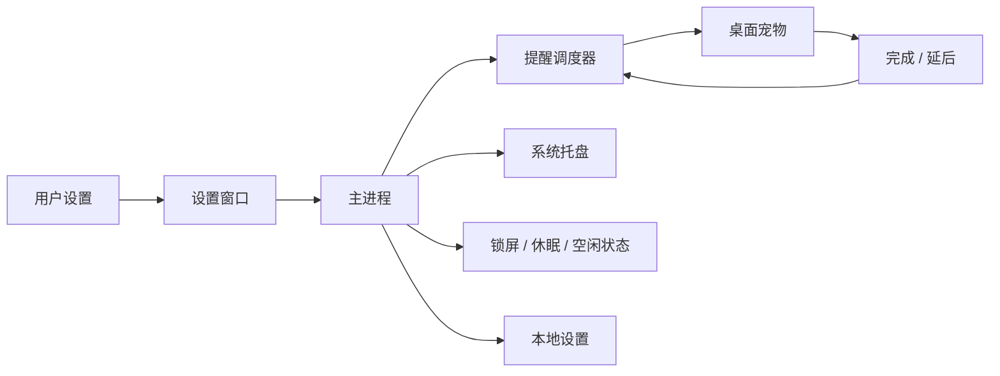
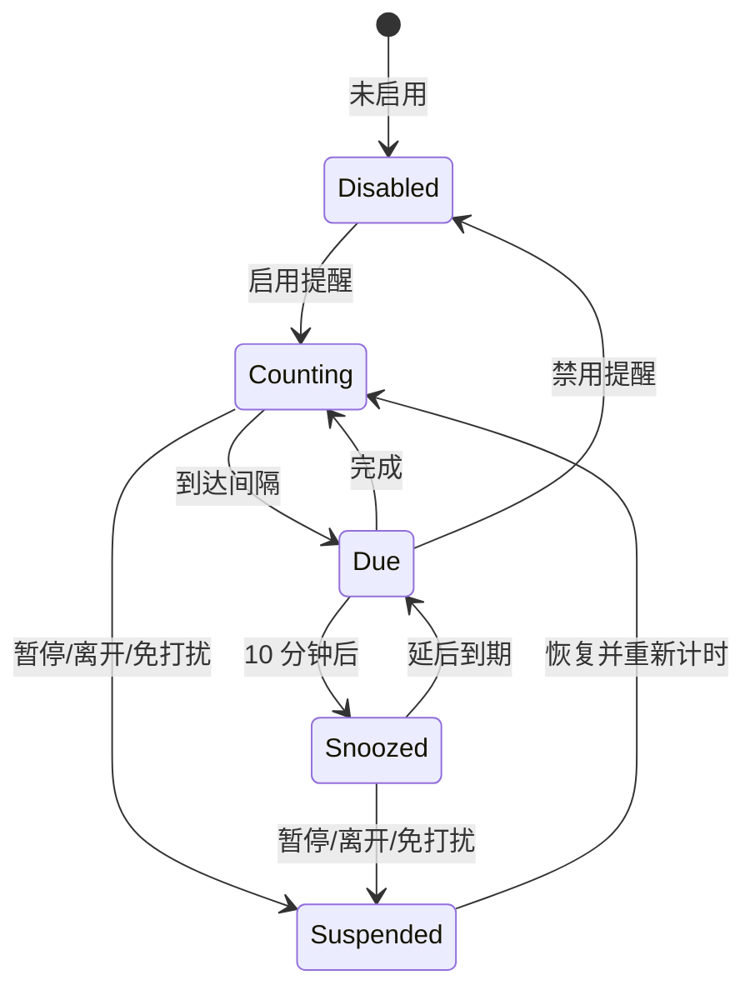

# Pocket Pause 项目设计文档

| 项目 | 内容 |
| --- | --- |
| 文档状态 | 工作基线 |
| 产品阶段 | MVP 功能完成，进入开源 Beta 发布准备阶段 |
| 目标平台 | Windows、macOS |
| 最后更新 | 2026-08-14 |

本文档描述 Pocket Pause 的目标体验、已经实现的行为、技术边界和后续验收标准。若目标设计与当前代码不同，会明确标注实现差异。

## 1. 产品定义

Pocket Pause 是一款常驻系统托盘的桌面宠物。它通过温和、可操作的宠物气泡提醒用户喝水和起身活动，不追求复杂的健康管理，而是帮助长时间使用电脑的人建立稳定的短休息节奏。

### 1.1 要解决的问题

- 用户专注时容易忽略喝水和活动。
- 系统通知容易被批量忽略，普通计时器又不理解锁屏、休眠和离开场景。
- 健康类工具常要求账户、统计和复杂设置，使用成本偏高。

### 1.2 产品目标

- 用户可以在一分钟内完成设置并开始提醒。
- 提醒出现时可以直接完成或延后，无需打开主窗口。
- 用户不在电脑前或处于免打扰时间时不产生无效提醒。
- 应用可以长期驻留，重启后仍保留设置和宠物位置。
- 默认完全本地运行，不收集行为数据。

### 1.3 非目标

- 不提供医疗建议或饮水量诊断。
- MVP 不做账号、云同步、排行榜或社交功能。
- MVP 不记录详细健康历史或工作效率数据。
- MVP 不支持任意提醒类型、复杂日历规则和团队策略。
- 宠物装扮、成就系统不能优先于提醒可靠性。

## 2. 用户与核心场景

核心用户是每天长时间使用电脑的办公人员、开发者、设计师、学生和远程工作者。

1. 用户首次启动应用，设置喝水和活动间隔，然后关闭设置页继续工作。
2. 到期后宠物在桌面边缘出现，用户选择“完成”或“10 分钟后”。
3. 两个提醒同时到期，宠物在一个气泡中提供两组独立操作。
4. 用户锁屏、休眠或离开电脑，提醒自动暂停；返回后重新开始完整间隔。
5. 用户在夜间免打扰时间继续使用电脑，应用保持安静。
6. 用户通过托盘临时暂停提醒、显示宠物、打开设置或退出应用。

## 3. 设计原则

### 安静但可感知

提醒不抢夺输入焦点，不播放默认声音，不持续重复弹出。宠物通过位置、动作和简短文字表达状态。

### 一步完成

“完成”和“延后”直接出现在提醒气泡中，常用操作不要求进入设置页。

### 状态可解释

设置页明确显示当前是运行、手动暂停、系统离开暂停还是免打扰，避免用户不知道为什么没有提醒。

### 本地优先

设置和运行状态由本机管理。除非未来引入明确的可选能力，否则应用不建立网络连接。

### 可靠性优先

系统休眠、时钟变化、多显示器变化和异常退出不能产生密集补发、屏幕外窗口或不可恢复状态。

## 4. 当前完成度

项目已经具备完整的本地 MVP 调用链，不再处于概念或静态界面原型阶段：



| 能力 | 当前状态 | 发布前要求 |
| --- | --- | --- |
| 核心提醒闭环 | 已完成 | 补充异常和长时间运行测试 |
| 设置与本地持久化 | 已完成 | 继续补充主进程集成测试 |
| 多时段免打扰与跨午夜 | 已完成 | 明确开始时间等于结束时间的 UI 含义 |
| 锁屏、休眠和空闲暂停 | 已完成 | 在 Windows、macOS 真机验证 |
| 托盘与单实例 | 已完成 | 验证开机启动和第二实例场景 |
| 桌面宠物交互 | 已完成 | 补充隐藏动画竞态与真机缩放验证 |
| 内置外观主题 | 已完成 | 3 个宠物形象与 3 套界面/托盘图标 |
| 安全隔离 | 已完成基础加固 | 继续补充更完整的 IPC 集成测试 |
| 自动化测试 | 部分完成 | 覆盖存储、主进程、IPC 和关键 UI 流程 |
| 发布工程 | 基础完成 | Windows 与 macOS 自动构建；仍需签名、公证、真机安装验证和升级策略 |

结论：当前是“可运行的 MVP”，下一里程碑应是内部 Beta，而不是继续扩展新功能。

## 5. 功能范围

### 5.1 MVP 范围

- 喝水提醒和起身活动提醒。
- 每种提醒独立启用和设置间隔。
- 完成与固定 10 分钟延后。
- 最多 8 个同日或跨午夜免打扰时段。
- 手动暂停、系统离开暂停和恢复计时。
- 透明置顶宠物窗口和系统托盘。
- 薄荷猫、蜂蜜熊、云朵兔 3 个内置宠物，以及柔和、描边、像素 3 套图标样式。
- 开机启动开关。
- 本地设置和宠物位置持久化。
- 单实例运行。

### 5.2 Beta 候选

- 登录启动时静默驻留托盘，手动启动时打开设置。
- 可配置延后时长。
- 提醒超时后的温和收起策略。
- 系统原生通知作为宠物窗口失败时的降级方案。
- 首次使用引导和“测试提醒”按钮。
- 更完整的键盘操作、焦点样式和屏幕阅读器语义。

### 5.3 暂缓能力

- 可下载宠物、皮肤商城和复杂成长系统。
- 云同步、账号和跨设备状态。
- 饮水量、卡路里或医疗建议。
- 团队管理和管理员强制策略。

## 6. 提醒规则

### 6.1 默认值

| 设置 | 默认值 | 有效范围 |
| --- | --- | --- |
| 喝水间隔 | 45 分钟 | 1 至 480 分钟 |
| 起身间隔 | 60 分钟 | 1 至 480 分钟 |
| 延后时间 | 10 分钟 | 当前固定 |
| 免打扰 | 启用，默认 1 个时段 | 最多 8 个；默认 22:00 至次日 08:00 |
| 宠物形象 | 薄荷猫 | 薄荷猫、蜂蜜熊、云朵兔 |
| 图标样式 | 柔和 | 柔和、描边、像素 |
| 空闲判定 | 5 分钟 | 当前固定 |
| 开机启动 | 关闭 | 布尔值 |

### 6.2 计时锚点

以下事件发生后，所有已启用提醒从完整间隔重新计时：

- 应用启动并初始化调度器。
- 用户取消手动暂停。
- 用户从锁屏、休眠或空闲状态恢复。
- 用户离开免打扰时段。

“完成”只重置对应提醒；“10 分钟后”只修改对应提醒的下一次到期时间。

保存设置采用局部更新规则：

- 某类提醒的启用状态或间隔变化时，只重置该类型。
- 只修改免打扰、外观、开机启动或重复保存相同值时，保留已有倒计时和延后状态。
- 禁用某类提醒时，立即取消它的计时并从待处理气泡中移除。

### 6.3 到期与合并

- 每种提醒独立维护下一次到期时间。
- 到期后该提醒停止继续计时，直到用户完成、延后或设置发生变化。
- 同一调度周期内多个提醒到期时，合并为一个宠物气泡。
- 每个合并项保留独立的完成和延后操作。
- 隐藏宠物不等于处理提醒，再次显示时仍应看到未处理项目。

### 6.4 免打扰与暂停

- 用户可以设置 1 至 8 个免打扰时段，任一时段命中即进入免打扰。
- 开始时间包含在免打扰范围内，结束时间不包含。
- 每个时段独立判断；开始时间晚于结束时间时，该时段跨越午夜。
- 时段可以重叠，重叠部分不会改变行为，也不会导致重复状态切换。
- 当前实现把任一时段的开始时间等于结束时间解释为全天免打扰。
- 退出免打扰后不补发期间错过的提醒，而是重新开始完整间隔。
- 系统离开包括系统休眠、锁屏，以及系统空闲时间达到 5 分钟。

提醒是否可运行由三个条件共同决定：

```text
可运行 = 非手动暂停 AND 非系统离开 AND 非免打扰
```

### 6.5 单提醒状态



禁用已经到期的提醒时，主进程会立即从气泡中移除对应项目。

## 7. 界面与交互

### 7.1 设置窗口

信息顺序为品牌、当前状态、外观、提醒计划、免打扰、开机启动及保存反馈。外观区域使用分段单选组展示内置宠物和图标预览；免打扰区域以紧凑列表展示多个时段，并提供添加和删除操作。保存成功后明确告知设置已保存；保存失败时应保留用户输入并显示可恢复的错误信息。

### 7.2 宠物窗口

- 默认透明、无边框、置顶，不显示在任务栏。
- 宠物形象通过同一套可动画 DOM 和主题样式绘制，切换外观不改变窗口尺寸和交互区域。
- 提醒气泡中的类型图标跟随柔和、描边或像素样式。
- 宠物主体区域可拖动，按钮区域不可拖动。
- 提醒出现时不主动抢占键盘焦点。
- 用户可以隐藏宠物，但隐藏不清除待处理提醒。
- 恢复坐标时必须保证窗口与任一可用显示器相交。

### 7.3 托盘菜单

- 显示或隐藏宠物。
- 打开设置。
- 暂停或恢复提醒。
- 切换开机启动。
- 退出应用。

托盘图标跟随所选图标样式；Windows 使用对应彩色 PNG，macOS 使用同轮廓的模板图标。

托盘菜单文字和勾选状态必须与实际状态同步。退出是唯一应彻底关闭应用的常规入口。

### 7.4 启动行为目标

| 场景 | 目标行为 | 当前行为 |
| --- | --- | --- |
| 首次手动启动 | 显示设置页 | 显示设置页 |
| 后续手动启动 | 显示设置页 | 显示设置页 |
| 开机登录启动 | 静默进入托盘 | 静默进入托盘 |
| 启动第二实例 | 激活已有设置页 | 已实现 |
| macOS Dock 激活 | 显示设置页 | 已实现 |

## 8. 技术架构

### 8.1 技术选型

- Electron 负责桌面窗口、系统托盘、电源状态和登录启动。
- CommonJS 作为当前模块系统。
- 原生 HTML、CSS、JavaScript 构建两个轻量渲染页面。
- Node.js 内置测试运行器测试纯逻辑模块。
- electron-builder 构建 Windows NSIS 和 macOS DMG。

当前规模下不引入前端框架是合理选择。只有在设置界面明显复杂化、组件复用或状态管理成本上升时，才重新评估框架。

### 8.2 进程职责

| 层 | 职责 | 不应承担 |
| --- | --- | --- |
| 主进程 | 权威状态、调度、持久化、窗口、托盘、系统事件 | 页面展示细节 |
| preload | 提供固定、窄范围的 IPC 接口 | 暴露通用 `ipcRenderer` 或 Node.js |
| 设置渲染进程 | 编辑设置、展示调度状态 | 自行计算提醒时间 |
| 宠物渲染进程 | 展示宠物状态、提交提醒动作 | 修改权威状态或读写文件 |
| shared | 默认值、输入校验、无平台公共逻辑 | Electron 生命周期 |

### 8.3 模块边界

- `src/main/main.js`：组合根，管理 Electron 对象和跨模块协调。
- `src/main/scheduler.js`：不依赖 Electron 的提醒状态机。
- `src/main/store.js`：设置文件加载与原子替换保存。
- `src/main/window-position.js`：可测试的多显示器窗口边界计算。
- `src/shared/defaults.js`：默认设置和固定策略常量。
- `src/shared/validation.js`：把不可信输入归一化为完整设置。
- `src/preload/*.js`：渲染进程能力白名单。
- `src/renderer/*`：纯展示与用户交互。

后续应避免继续扩张 `main.js`。当窗口恢复、登录启动或提醒协调逻辑显著增加时，可以拆分 `window-manager` 和 `reminder-controller`，但目前不需要为了目录整齐而提前抽象。

## 9. IPC 契约

| 通道 | 方向 | 类型 | 作用 |
| --- | --- | --- | --- |
| `settings:get` | 设置页 -> 主进程 | invoke | 获取设置和调度状态 |
| `settings:save` | 设置页 -> 主进程 | invoke | 校验、保存并应用设置 |
| `pet:hide` | 宠物页 -> 主进程 | send | 隐藏宠物窗口 |
| `reminder:action` | 宠物页 -> 主进程 | send | 完成或延后指定提醒 |
| `settings:changed` | 主进程 -> 设置页 | event | 同步外部设置变化 |
| `status:changed` | 主进程 -> 设置页 | event | 同步暂停和免打扰状态 |
| `pet:state` | 主进程 -> 宠物页 | event | 更新宠物动画、提醒列表和外观主题 |

所有来自渲染进程的数据都应视为不可信输入。主进程必须校验提醒类型、动作和值域，不依赖 HTML 控件约束。

## 10. 数据设计

设置文件位于 `app.getPath('userData')/settings.json`，结构如下：

```json
{
  "reminders": {
    "water": { "enabled": true, "intervalMinutes": 45 },
    "stand": { "enabled": true, "intervalMinutes": 60 }
  },
  "quietHours": {
    "enabled": true,
    "periods": [
      { "start": "22:00", "end": "08:00" }
    ]
  },
  "appearance": {
    "petStyle": "mint-cat",
    "iconStyle": "soft"
  },
  "launchAtLogin": false,
  "petPosition": { "x": 1200, "y": 700 }
}
```

设计约束：

- `petPosition` 可选，首次启动使用主显示器右下角位置。
- `quietHours.periods` 保留 1 至 8 个合法时段；旧版的 `quietHours.start/end` 在读取时自动迁移为单元素数组。
- `appearance.petStyle` 和 `appearance.iconStyle` 只接受内置白名单值；旧配置或非法值回退到默认外观。
- 读取失败、JSON 损坏或字段非法时回退到默认值。
- 写入时先生成临时文件，再替换正式文件，降低部分写入风险。
- 不持久化 `nextDue`、延后状态或待处理提醒，避免休眠和时钟变化导致补发风暴。
- 开机启动状态以操作系统返回值为准，而不是盲目信任旧设置文件。

未来变更数据结构时，应增加 `schemaVersion` 和显式迁移函数，避免把“校验失败后全部恢复默认”当作升级策略。

## 11. 安全与隐私

### 已实现

- `contextIsolation: true`。
- `nodeIntegration: false`。
- 渲染进程沙箱开启。
- preload 只暴露业务方法，不暴露通用 IPC。
- 设置通过归一化函数限制字段和值域。
- 页面不加载远程脚本，也不使用账户和网络服务。
- 页面 CSP、导航拦截、新窗口拦截和 IPC 发送者校验已启用。

### 发布前补充

- 为 IPC 参数继续增加结构检查，覆盖更多异常对象和窗口生命周期场景。
- 明确隐私说明：本地保存哪些数据、不会收集哪些数据。

## 12. 异常与恢复策略

| 异常 | 目标行为 | 当前状态 |
| --- | --- | --- |
| 设置文件不存在或损坏 | 使用默认设置继续启动 | 已实现 |
| 保存设置失败 | 保留表单并展示错误，不应用半套状态 | 已实现 |
| 显示器被移除 | 将宠物移动到最近的可见工作区 | 已实现 |
| 渲染页面崩溃 | 可重载窗口，调度状态保持在主进程 | 未实现 |
| 系统长时间休眠 | 恢复后重新计时，不批量补发 | 基础实现 |
| 第二实例启动 | 聚焦已有设置窗口 | 已实现 |
| 托盘创建失败 | 保留可退出、可打开设置的降级入口 | 未实现 |

## 13. 可访问性与视觉要求

- 所有图标按钮提供中文 `title` 和 `aria-label`。
- 开关和输入框支持键盘操作及可见的 `:focus-visible` 状态。
- 提醒气泡使用 `aria-live="polite"`，避免打断当前屏幕阅读。
- 遵循 `prefers-reduced-motion`，减少到达、离开和宠物动画。
- 文本缩放后不能遮挡操作按钮；窗口最小尺寸下必须可滚动。
- 颜色不能是状态的唯一表达方式，状态点需配合文本。
- 设置窗口使用系统原生标题栏，保留标准窗口操作、拖动和系统快捷键。

## 14. 测试策略

### 14.1 单元测试

- 独立间隔、同时到期、完成、延后和禁用。
- 单个及多个同日或跨午夜免打扰时段、开始等于结束、旧配置迁移。
- 暂停、系统离开以及多种暂停原因交叠。
- 设置更新和非法设置归一化。
- 外观白名单、设置保存后宠物与托盘图标同步。
- 设置文件缺失、损坏、写入和重新加载。
- 时钟向前或向后变化时不密集补发。

### 14.2 主进程集成测试

- 设置保存后同步调度器、托盘和设置页。
- 禁用已到期提醒时立即清理待处理项。
- 单实例和窗口关闭/隐藏生命周期。
- 宠物位置在单屏、多屏和显示器移除后的恢复。
- 登录启动与手动启动采用不同显示策略。

### 14.3 端到端验证

至少在 Windows 和 macOS 分别验证全新安装、保存设置、提醒动作、双提醒合并、锁屏与休眠、多个及跨午夜免打扰时段、开机启动、托盘退出、卸载和显示器变化。

覆盖率数字不能代替系统行为测试。当前覆盖率报告只统计被单元测试导入的模块，并不代表整个 Electron 应用已有相同覆盖率。

## 15. 发布设计

### 15.1 构建目标

- Windows：x64 NSIS 安装包，首个公开版本为 `v0.1.0`。
- macOS：DMG，应用类别为健康与健身。
- 构建输出目录：`release/`。
- 推送与 `package.json` 一致的 `v*` 标签后，由 GitHub Actions 构建并上传 Windows x64、macOS x64 和 macOS arm64 安装包。

### 15.2 发布门槛

- Windows ICO、macOS ICNS、托盘图标和安装包视觉资产通过发布验收。
- Windows 安装包签名；macOS 应用签名并完成公证。
- 在干净虚拟机完成安装、升级、卸载和残留检查。
- 版本号、更新日志和下载文件名一致。
- 无阻塞级崩溃，无宠物窗口永久丢失，无密集补发。
- 明确自动更新策略；未实现自动更新时提供手动升级说明。

### 15.3 开源治理

- 源代码使用 MIT License。
- `main` 分支和 Pull Request 执行语法检查与自动化测试。
- 贡献规则、安全报告方式和版本变化分别由 `CONTRIBUTING.md`、`SECURITY.md` 和 `CHANGELOG.md` 管理。
- 证书、密码和访问令牌只能通过 CI Secrets 注入，不能提交到仓库。
- GitHub Release 是安装包的唯一官方公开下载来源。

## 16. 路线图

### P0：内部 Beta 基线

- 修复当前工作区依赖链接并验证冷启动。
- 补齐关键主进程、IPC 和渲染层测试。

### P1：体验完善

- 首次使用引导和测试提醒。
- 可配置延后时间。
- 提醒长时间未处理时的收起与重新展示规则。
- 键盘导航、焦点状态和屏幕阅读器验证。
- Windows、macOS 真机长时间运行测试。
- 代码签名和安装包验收。

### P2：谨慎扩展

- 更多可选宠物动作与本地主题扩展。
- 可选、完全本地的简单完成统计。
- 原生通知降级通道。
- 自动更新。

P2 功能只有在提醒可靠性和发布工程稳定后才进入开发。

## 17. Beta 验收标准

- 全新环境可以按照 README 完成安装、测试和启动。
- 用户可以配置并触发两类提醒，完成和延后语义正确。
- 锁屏、休眠、离开和免打扰期间不弹出提醒，恢复后不补发。
- 设置和宠物位置重启后保留，显示器变化不会让窗口永久不可见。
- 登录启动不弹设置页，手动启动和第二实例能打开已有设置页。
- 保存失败有明确反馈，损坏的设置文件不会阻止应用启动。
- Windows 与 macOS 的核心流程均完成真机验证。
- 安装包拥有正式图标、签名和可重复的构建步骤。
- 调度、存储和关键主进程协调逻辑具有自动化测试。

## 18. 待确认的产品决策

- 开始时间等于结束时间应表示全天免打扰，还是应禁止保存？
- 未处理提醒是否自动收起；若收起，何时再次出现？
- 延后时间保持固定，还是允许用户配置多个选项？
- 是否需要默认静音之外的可选提示音？
- 宠物窗口不可展示时，是否使用系统通知作为降级？
- 是否提供完全本地、默认关闭的完成次数统计？
- 首次启动后，后续手动启动应总是打开设置，还是仅显示托盘？

这些决策会改变用户可见行为，应在编码前确定，并同步到提醒规则、测试和 README。
